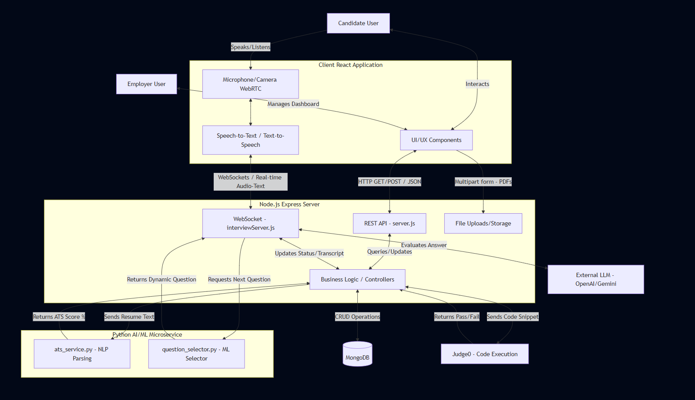

# AI-Powered Job Board & Interview Platform

A full-stack AI recruitment platform featuring automated ATS resume scoring, real-time conversational AI interviews, and integrated code execution assessments. This multi-tier architecture separates front-end interactions, robust core back-end management, and computationally heavy AI workflows.

## System Architecture and Data Flow


The platform uses a service-oriented architecture divided into three main components:

- **Frontend (React/Vite)**: Provides an interactive UI with real-time video/audio capabilities. Employs \useSpeechToText\ and \useTextToSpeech\ hooks for seamless conversational voice interactions.
- **Node.js Core Backend (Express)**: Serves as the primary orchestrator handling user authentication, RESTful routing, and database interactions (MongoDB). It uses WebSockets via Socket.io to manage live, bi-directional communication during AI interviews, and integrates with Judge0 for code execution.
- **Python AI Microservice**: Offloads heavy NLP and machine learning processes. It calculates candidate ATS scores using resume parsing (\ts_service.py\) and handles dynamic question generation (\question_selector.py\).

## Data Flow

The system manages workflows for **ATS Parsing** and **Live AI Interviews**. Nodes in the workflow include real-time browser WebRTC communication, websocket streams to the Node.js backend, LLM parsing, scoring handled by the Python microservice, and code evaluation handled by isolated Docker containers.

_(You can add an architecture diagram image here)_

## Getting Started

### 1️⃣ Start Python Microservice

```bash
cd python-server
pip install -r requirements.txt
python -m spacy download en_core_web_sm
uvicorn app:app --reload --host 0.0.0.0 --port 8000
```

2️⃣ Start Backend (Node.js)

```bash
cd backend
npm install
npm run dev
```

3️⃣ Start Frontend

```bash
cd frontend
npm install
npm run dev
```

Docker Commands

```
docker run -d --name piston_api -p 2000:2000 --privileged -v piston_data:/piston ghcr.io/engineer-man/piston
```

Check container status:

```
docker ps
docker logs piston_api
```

Install languages:
JavaScript (node)

```
Invoke-WebRequest -Uri "http://localhost:2000/api/v2/packages" -Method POST -Headers @{"Content-Type"="application/json"} -Body '{"language":"javascript","version":"18.15.0"}' -UseBasicParsing
```

Python

```
Invoke-WebRequest -Uri "http://localhost:2000/api/v2/packages" -Method POST -Headers @{"Content-Type"="application/json"} -Body '{"language":"python","version":"3.10.0"}' -UseBasicParsing
```

GCC — covers both C and C++

```
Invoke-WebRequest -Uri "http://localhost:2000/api/v2/packages" -Method POST -Headers @{"Content-Type"="application/json"} -Body '{"language":"gcc","version":"10.2.0"}' -UseBasicParsing
```

Java

```
Invoke-WebRequest -Uri "http://localhost:2000/api/v2/packages" -Method POST -Headers @{"Content-Type"="application/json"} -Body '{"language":"java","version":"15.0.2"}' -UseBasicParsing
```

Daily Use Commands
Start Piston when beginning work:

```
docker start piston_api
```

Stop Piston when done working:

```
docker stop piston_api
```

Check if Piston is running:

```
docker ps
```

View Piston logs if something goes wrong:

```
docker logs piston_api
```
